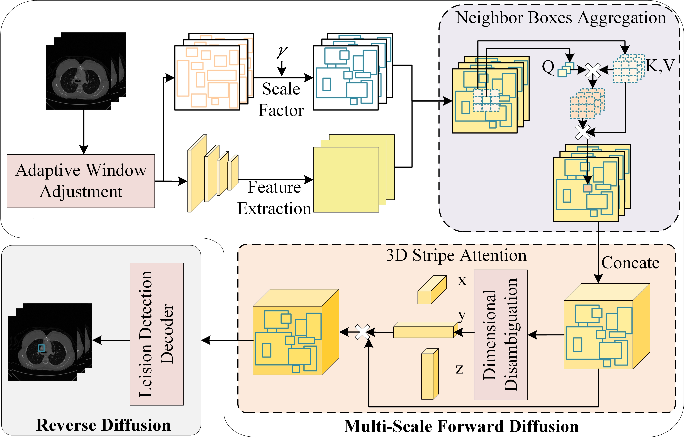

# DetectDifuse: Adaptive Aggregation Quantum Difusion Model for Universal Lesion Detection

**DetectDifuse is an framework of quantum  diffusion model for universal lesion detection.**



## Getting Started

#### Installation

###### Requirements

- Linux or macOS with Python ≥ 3.6
- PyTorch ≥ 1.9.0 and [torchvision](https://github.com/pytorch/vision/) that matches the PyTorch installation.
  You can install them together at [pytorch.org](https://pytorch.org) to make sure of this
- OpenCV is optional and needed by demo and visualization
- More requirements can be found in requirements.txt.
- These should install in about 10 mins.

Steps

1. Install Detectron2 following https://github.com/facebookresearch/detectron2/blob/main/INSTALL.md#installation.
2. Prepare datasets and  link it to detectron2.
3. install Requirements: `pip install -r requirements.txt`
4. Datasets' links:

deeplesion dataset: https://nihcc.app.box.com/v/DeepLesion

BraTS2021 dataset: https://www.kaggle.com/datasets/dschettler8845/brats-2021-task1

Task08 dataset: https://www.kaggle.com/datasets/oldyan/task08-hepaticvessel?select=imagesTr

Covid-19-20 dataset: https://covid-segmentation.grand-challenge.org/Download/

LNQ2023 dataset: https://lnq2023.grand-challenge.org/

LiTS dataset: https://drive.google.com/drive/folders/0B0vscETPGI1-Q1h1WFdEM2FHSUE?resourcekey=0-XIVV_7YUjB9TPTQ3NfM17A

```
for the dataset end with "*.nii.gz/*.nii", 
python dataset_process/nii2coco.py

for the other end with "*.nrrd",
python dataset_process/nrrd2coco.py

mkdir -p datasets/trainset
...

ln -s /path_to_dataset/annotation datasets/trainset/annotation
ln -s /path_to_dataset/image datasets/trainset/image
...
```

## Train

Please use the config file in configs/diffdet.coco.res50.yaml and customize your parameters!

Train instruction:

```
python train_net_lesion.py --config-file configs/diffdet.coco.res50.yaml
```

Training duration depends on equipment performance and is typically completed within a week.

## Inference

Please modificate the `"MODEL-WEIGHTS"` in congfig to your model path.

Inference instruction:

```
python train_net_lesion.py --config-file configs/diffdet.coco.res50.yaml --eval-only True
```

Training duration depends on equipment performance and is typically completed within several hours.

After inference, a `.pkl` file  and a `.json` file of the result will be generated in the output folder which you set in the config file.

## Visualization and evaluation

`python test.py`

After run the code, the visualization results will generated in the output folder which you set in the code, and the evaluation result will  be printed in the terminal.

## License

This project is under the CC-BY-NC 4.0 license. See [LICENSE](LICENSE) for details.

## Acknowledgments
This project builds upon multiple open-source frameworks and prior research. We extend our sincere gratitude to the following works:

DiffusionDet (Chen et al., ICCV 2023): The diffusion detection module of this project references the core architecture and training strategy of DiffusionDet. We adapted it for medical images and extended it with quantum noise modeling. Original project URL: [https://github.com/ShoufaChen/DiffusionDet](https://github.com/ShoufaChen/DiffusionDet)

DeepLesion Dataset (Yan et al., MICCAI 2018): This project utilizes the DeepLesion dataset as the primary training and evaluation data source. We thank the original authors for providing high-quality, publicly available medical imaging resources.
